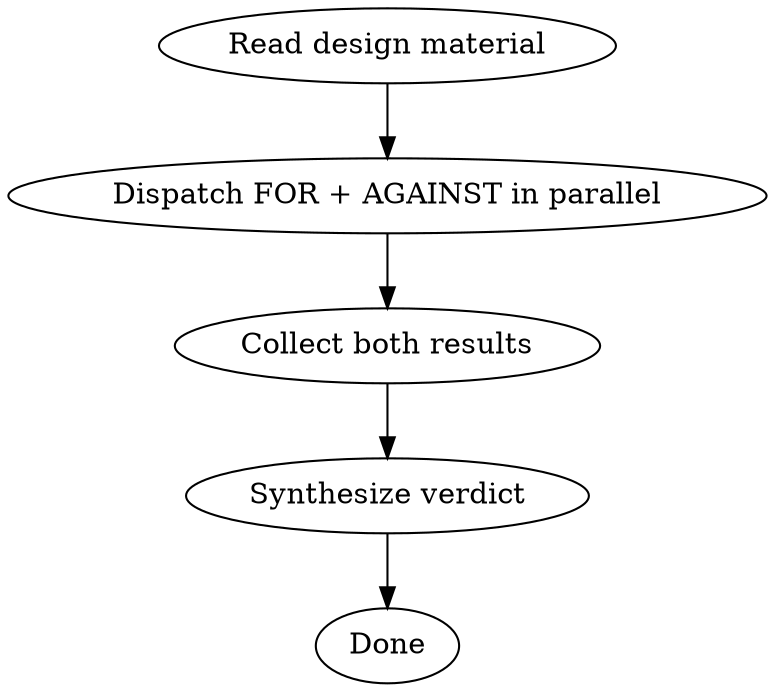

# FOR/AGAINST Design Review

Dispatch two parallel subagents to independently steel-man both sides of a design decision, then synthesize a verdict. Used before committing to architectural choices, spec decisions, or implementation approaches.

## When to Use

- Before writing a plan or spec for a non-trivial design decision
- When a proposed approach has trade-offs that are hard to evaluate alone
- After a spec is drafted, to stress-test it before implementation begins
- When two approaches are being compared and the right choice isn't obvious

## Process



### Step 1: Prepare the material

Gather everything the agents need:
- The design spec, proposal, or decision being reviewed
- Any relevant code, constraints, or context
- The specific question: "Should we do X or Y?" or "Is this approach sound?"

Do NOT send agents to read files themselves — extract and provide the text directly. Agents with missing context will produce weak arguments.

### Step 2: Dispatch FOR and AGAINST in parallel

Use a single message with two Agent tool calls. Each agent gets:
- The full design text
- Their assigned role (FOR or AGAINST)
- The mandatory failure-mode checklist (see below)
- A word budget (~400 words)

**FOR agent prompt template:**
```
You are the FOR agent. Steel-man the strongest possible case IN FAVOR of the following design/approach.

Be specific and technical. No hedging. Argue as if you chose this approach and are defending it to skeptics.

[INSERT DESIGN TEXT]

Required sections:
1. Core strengths (2-3 bullets, specific not generic)
2. Why alternatives are worse (compare to the most likely alternatives)
3. Failure modes you considered and why they don't apply here

Word limit: ~400 words.
```

**AGAINST agent prompt template:**
```
You are the AGAINST agent. Find the strongest possible case AGAINST the following design/approach.

Be ruthless and specific. No softening. Find real failure modes, not hypothetical ones.

[INSERT DESIGN TEXT]

Required sections:
1. Real failure modes (not theoretical — what actually breaks and when)
2. Fresh install / edge case gaps (what breaks on a machine with no prior state?)
3. What a code reviewer would catch that the author missed
4. Better alternatives (concrete, not hand-wavy)

Word limit: ~400 words.
```

### Step 3: Synthesize a verdict

After both agents complete, synthesize:

```
For each design dimension:
- FOR argument: [key point]
- AGAINST argument: [key point]
- Verdict: Go / Go with conditions / No-go
- Conditions (if any): [specific changes required]
```

End with a single **Overall verdict** and the top 1-2 actionable changes if "Go with conditions."

## What Worked (Keep)

- **Parallel dispatch** — genuinely independent perspectives, fast
- **Steel-manning** — forces the strongest version of each argument, not strawmen
- **Covering multiple dimensions** — architecture, API design, edge cases, alternatives
- **Requiring concrete alternatives** in AGAINST, not just "this is bad"

## What Didn't Work (Iterate)

- **Architecture-only scope** — reviews were too high-level, missed implementation bugs like predicate logic errors, fresh-install gaps, tmp file collisions
- **No mandatory failure-mode section** — add the explicit "what breaks on a fresh install?" and "what would a reviewer catch?" questions to AGAINST agent
- **Synthesis without action items** — verdict must include concrete conditions, not just "proceed carefully"

## Scope Guidelines

| Task size | Use FOR/AGAINST? |
|-----------|-----------------|
| Trivial (1 file, obvious approach) | No — just implement |
| Small with real trade-offs | Yes — single round |
| Spec with multiple design dimensions | Yes — one round per major decision |
| Implementation review (post-coding) | No — use code review instead |

FOR/AGAINST reviews design decisions, not implementations. For catching implementation bugs, use the Opus code review with explicit failure-mode questions in the prompt.

## Failure Modes of This Process

- **Weak material** — if the design text is vague, both agents produce generic arguments. Always provide concrete context.
- **Over-applying it** — don't run FOR/AGAINST on every choice. Reserve for genuine trade-offs.
- **Ignoring conditions** — "Go with conditions" means the conditions are mandatory, not suggestions.

## Additional Resources

- `references/synthesis-template.md` — structured synthesis table template
- `references/against-checklist.md` — mandatory failure-mode checklist for AGAINST agent
